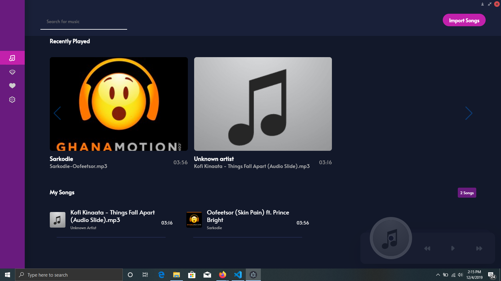

# Electron Music 
> A simple desktop music application built with Electron and React

This player allows you to import and play songs from your local computer as well as search for and stream audio files from SoundCloud

## Installation
Simply clone or download this repository `git clone https://github.com/mr-tackie/electron-music.git`

Run `npm i` to install all node dependencies.

To add music simply click on the Import button and select a folder to add to your library

## Screenshots

## TODO
1. Playlist functionalities 
2. Favorites 
3. settings

## Contributing

1. Fork it
2. Create your feature branch (`git checkout -b feature/fooBar`)
3. Commit your changes (`git commit -am 'Add some fooBar'`)
4. Push to the branch (`git push origin feature/fooBar`)
5. Create a new Pull Request

## Meta

Nii Abonie Tackie – [@_tackie_](https://twitter.com/_tackie_)
